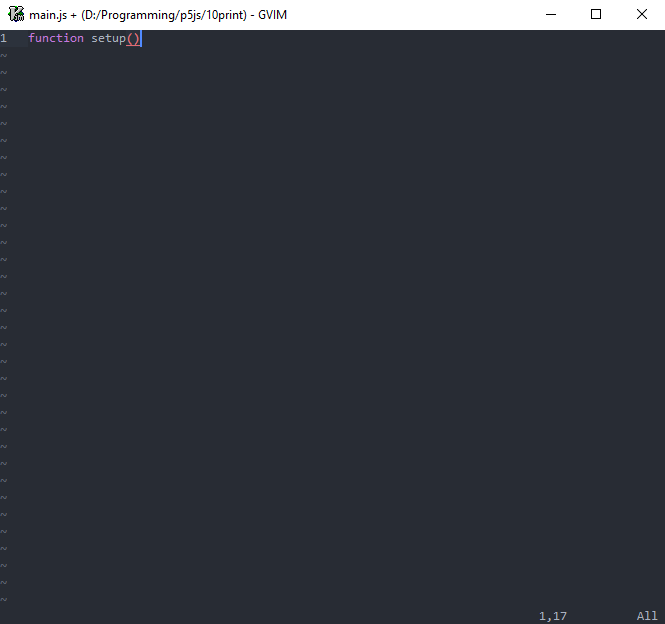

# Tern def file for p5.js

## Background

I was looking for a way to create tern def file for p5.js. User [kaganjd](https://gist.github.com/kaganjd) has generated one on [this gist](https://gist.github.com/kaganjd/c1c88b17063cf53651b0f2c42218de5c) (which I downloaded on January 13 2018, and in this repo the filename is `p5-original.json`). To my disappointment it doesn't work on my [`tern_for_vim`](https://github.com/ternjs/tern_for_vim) plugin. So I look around and found out that it must be edited to work.

On `p5.json` I have modified the original JSON file so that it could work with `tern_for_vim` plugin. It works for `p5.js`, `p5.dom`, and `p5.sound`. Note that in the original def file there are some functions named `undefined`, which I deleted on the def file that I modified. 

The def file is far from perfect. A lot of it I modified manually based on my crude understanding of the def file's syntax.

TODO:
- [x] Tern def file for `p5.js`
- [x] Tern def file for `p5.dom`
- [x] Tern def file for `p5.sound`
- [ ] Maybe automate the process

Here is the proof that it works:

